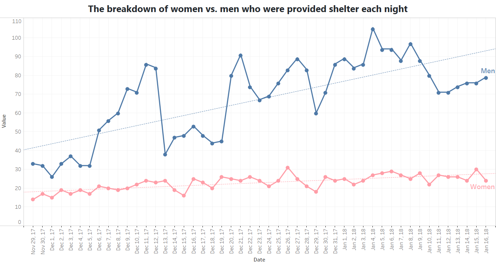
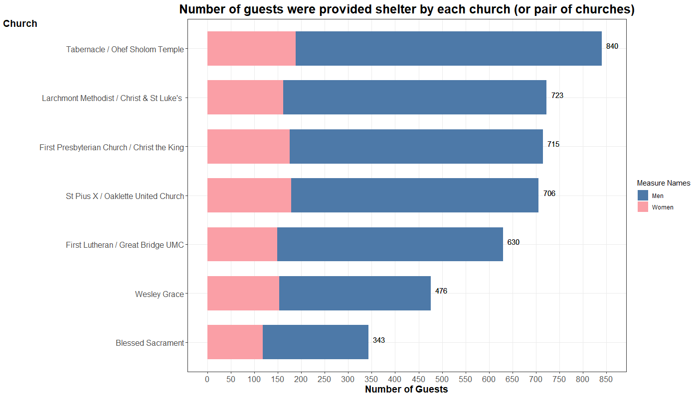
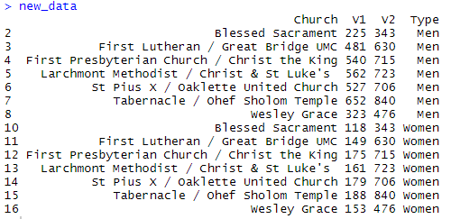

Homework 3
================
**Lalita Sharkey**  
10/01/2019

CS 625, Fall 2019
## Initial data observation and data transformation 
Before I started creating visualizations, I did some observation to gain a better understanding of the datasets. There were 2 datasets given. The first dataset is daily breakdown information of Norfolk churches that provide shelters for adults during winter (11/29/2017 to 1/16/2018). The other dataset contains information on daily weather information in the same duration as the first dataset. There were 49 samples in both the datasets. There were some fields with missing values and mixed values between numbers and a letter "T". Since question 3 required information from both datasets, I decided to join 2 tables using Microsoft Excel Power Query. I also normalized some fields namely "Total Demand",    "Temp Low",    "Precipitation",    "Snow", and    "Snow Depth". The purpose of normalization was to observe the differences when plotting the scatter plots for question number 3. Unfortunately, the result for both normalized and the original data were pretty much the same.  
## Question 1: What was the breakdown of women vs. men who were provided shelter each night?  
### Part 1 - Using Application (Tableau)  
  
### Part 2 - Using Programming Language/API (R)  
  
### Part 3 - Vega-Lite (Unfinished)
 
### Question 1 Chart Description  
A couple of experimental designs were created to find the most effective design. The first one that was created was the dual axises bar chart. It was the first thing that came to my mind. The vertical axis representing dates while the horizontal axis representing the number of both male and female guests. I aimed for a mirror-like bar chart style where the left-hand side depicted information of female guests and male information was displayed on the right-hand side. The first problem I encountered with that design was the chart was heavier on the right side as the numbers of male gues were so much higher than the numbers of the female guests. Another problem was the chart was too crowded. since the vertical axis presented 49 bars. Fortunately, once I read the assigned article, I discover that the line chart was a better option for time series data. The second design was done by utilizing *dotted line as its mark and colors as its channel.* The second design was obviously a better choice. It was so much cleaner and easier to read especially comparing numbers of male and female guests on each night. I also added a dashed trend line to emphasis the fact that the number of male guests was increasing much faster than female guests. I also removed the legend for the 2 color channels but instead, I used the label at the end of each line as I recall from the class that it easier for the audience understanding. I pick a blue color to represent the number of male guests and pink for female guests as they are gender color stereotypes. I believed without the line labels or legend the audience can still understand the reference. Instead of having smooth lines, I added dots in order to simplify the actual position of the values on certain dates. It could be quite difficult to virtually draw a straight line from the x-axis and look for the correct y value.
### Question 1 Experience of using an application versus a programming language/API
For Tableau, since it was the first question and I tried to aim for some complexed design, it was a daunting experience in the beginning. The first confusing was how to load a CSV file to Tableau. It took a few trials and errors to figure out I needed to select "Text file" option.  It also took me a while to understand how to create a dual-axis plot. Once I started to get a hang of it, it started to get easier. 
R was a different story since it was not a drag-drop interface like Tableau. I had to a lot of research in order to create a similar dual-axis dotted line plot the same way I did use Tableau. The challenge was, dates were not plotted on the x-axis in the right order namely the two dates from Nov 2017 were not in the right position. I tried to sort the data frame but it did not work. After extended studied, I found that the reason was because of the date-time formats. The date-time has to be read in with the specified format using ` MyData$Dates <-  as.Date(MyData$Dates, "%m/%e/%Y")`. That did not solve all the problem. I had to also reformat the output date-time that displayed on the x-axis as well using `scale_x_date(date_labels = "%b %d, %y")`. The other challenge was to justified and format elements on the plot including maintaining the look at feeling as the Tableau plot. Unfortunately, I couldn't finish my Vega-Lite as I was running out of time. However, I found it to be very a interesting API.

## Question 2: In total, how many guests were provided shelter by each church (or pair of churches)?
### Part 1 - Using Application (Tableau)
  

### Part 2 - Using Programming Language/API (R)


### Question 2 Chart Description 
To answer the second question with visualization, I used *the aligned spatial position as the plot's main channels and bars as the mark.* Besides, answering only the main question regarding the number of accommodated guests for each church or pair of the church, I believed I could provide more information on this visualization without making it too hard to understand. I decided the horizontal stacked bar chart was the right answer for me. I used *colors* as the plot's channel to depict the number of male guests. To make it easier for the audience to read the total numbers, I also added the total number of guests at the end of the bar. The legend for color reference was put to the right side of the chart. Similar to question 1, I stick to the gender color stereotypes as the theme for this plot as well. The plot was designed to display the number of total guests in descending order which I believe to be easier for comparison. 

### Question 2 Experience of using an application versus a programming language/API
The challenge of creating this chart with Tableau was how to implement a stacked bar chart. It was not as daunting as when I did the first plot using Tableau. Tableau made sorted horizontal stacked bar chart easy.
On the other hand, I faced many challenges when trying to resemble the stacked bar chart using R. I tried with both the default `barplot` and`geom_bar` using `library(ggplot2)`. In the beginning, I could not create the stacked bar chart the same way as I did for Tableau. After multiple attempts, I have come to realize that the problem was not about picking the correct library for stack bar chart but it was about how the data was stored in the data frame. I proceeded to manipulate the data frame and create a new data frame. I made a new column (v1) by using sum function for male and female guests which were grouped by the church. I also created a new column for sex which will be used as channel colors. I also added a column that contains the number of total guests (V2) so that I can display it at the end of each bar. There was a lot more work for formatting and customizing the plot. For example, I had to rotate the y-axis title. There were also things that I still did not figure out how to do it like create the wrapped text format for the axis text. I also would like to remove some of the empty white space on the left of the plot as well.

Below is the image of the new aggregated data frame.


## Question 3: Is total demand for shelter affected by weather?
### Part 1 - Using Application (Tableau)

### Part 2 - Using Programming Language/API (R)

### Question 3 Chart Description 
My first thought was to answer this question with correlation heatmap. I  attempt to create it with Tableau and that when I changed my mind and created 4 side by side scatter plots instead. Details about the correlation heatmap with Tableau can be found in the next section. *Mark of the plot was points and channels were color and position.*  The position from y-axis represented the number of shelter demand. There were 4 x-axises which represented precipitation, temperature low, snow depth, and snow values. I created 4 different x-axises because the range of value x was very varied. For example, the range of precipitation was from 0 - 1.5. However, the range of temp low was around 60. If I put all 4 features in the same plot. It will be too difficult to justify the right position of each point. To illustrate, most points will be clustered near x-axis and that can cause misinterpretation of the visualization. Different colors were used as one of the channels to indicate different churches. According to the result, there were some obvious clusters of churches. My assumption is the colored clusters were there because of the churches maximum capacities. 
### Question 3 Experience of using an application versus a programming language/API
My initial thought was question 3 visualizations were going to be the hardest one to create. Surprisingly, the scatter plots were not that difficult to create. I mention in the earlier section that my first thought was to create the correlation heatmap which I did try multiple times until I realized I will need more time to explore the Tableau Calculated Feild. If I had more time, I would like to accomplish that since I think it was a better choice for observing the relationship between multiple features. However, I learned that I need to create a new column in Tableau using "Pearson Correlation Coefficient".  It was unsuccessful according to the time limit since I would like to do some Vega-Lite plots as well.  It was pretty simple creating multiple scatter plots in Tableau. I just needed to drag measure values to column shelf and total demand to row shelf. On the contrary in R, I needed to install a `ggpubr` library so I can use `ggarrange()` function to create multiple scatter plots side by side. Plots formatting was not too hard to manage since it was similar to what I did for the first 2 plots. However, I tried to use the same colors for both Tableau and R plots but somehow the colors on R plots seemed to be a little darker.
## Vega-Lite Observable
https://observablehq.com/@lalitasharkey/homework-3  
### Question 1
```
{
  const men = vl.markLine().data(Data).encode(
    vl.x().fieldT('Date').axis({title: 'Date', format: "%b %d, %y",
                               labelAngle: -90, tickCount: 49}),
    vl.y().fieldQ('Men').axis({title: "Value"}),
  );
  const women = vl.markLine().data(Data).encode(
    vl.x().fieldT('Date').axis({title: 'Date', format: "%b %d, %y", 
                               labelAngle: 90, tickCount: 49}),
    vl.y().fieldQ('Women'),
    vl.color().value("#FA9FA6")
  );

  const wm_d = vl.layer(women, women.markCircle())
  const m_d = vl.layer(men, men.markCircle())
  const plot = vl.layer(men, women, wm_d, m_d)    
 
 return plot.render();
  
  
}
```
## R Code
### Question 1
```
MyData <- read.csv(file="merged.csv", header=TRUE, sep=",")

require(ggplot2)
library(tidyverse)


names(MyData)[names(MyData) == "ï..Date"] <- "Dates"
MyData$Dates <-  as.Date(MyData$Dates, "%m/%e/%Y")

g <- ggplot(MyData, aes(x=Dates, group= 1)) 
g <- g + scale_y_continuous(limits = c(0,110), breaks=seq(0,110,10), minor_breaks=seq(0,110,10))
g <- g + geom_line(aes(y=Men), colour="#4D79A8", size=2) + 
  geom_point(aes(y=Men), colour="#4D79A8", size=4) +
  geom_text(aes(y = Men[49]+7, x = Dates[49], label = "Men"), colour="#4D79A8", size = 6) + 
  geom_smooth(method = "lm", se=FALSE, color="#4D79A8", 
              aes(x = Dates, y = Men,group=1), size= 0.8, linetype = "dashed")
g <- g + geom_line(aes(y=Women), colour="#FA9FA6", size=2) + 
  geom_point(aes(y=Women),colour="#FA9FA6", size=4) +
  geom_text(aes(y = Women[49]-7, x = Dates[49], label = "Women"), colour="#FA9FA6", size = 6)  + 
  geom_smooth(method = "lm", se=FALSE, color="#FA9FA6", 
              aes(x = Dates, y = Women,group=1), size= 0.8, linetype = "dashed")
g <- g + theme_minimal()+theme_bw()
g <- g + scale_x_date(date_labels = "%b %d, %y", date_breaks = "1 day", date_minor_breaks = "1 day")
g <- g + theme(axis.text.x = element_text(angle = 90 , hjust = 1)) 
g <- g + labs(title = "The breakdown of women vs. men who were provided shelter each night", 
              x = "Date", y = "Value") 
g <- g + theme(plot.title = element_text(color = "black", size = 22, face = "bold", hjust = 0.5))

g
```
### Question 2
```
MyData <- read.csv(file="merged.csv", header=TRUE, sep=",")
require(ggplot2)
library(tidyverse)

names(MyData)[names(MyData) == "ï..Date"] <- "Dates"
MyData$Dates <-  as.Date(MyData$Dates, "%m/%e/%Y")

men_data = aggregate(cbind(MyData$Men, MyData$Total.Guests),  by=list(Church=MyData$Church), FUN=sum)
women_data = aggregate(cbind(MyData$Women, MyData$Total.Guests),  by=list(Church=MyData$Church), FUN=sum)
men_data$Church = reorder(men_data$Church, men_data$V2)
women_data$Church = reorder(women_data$Church, women_data$V2)
men_data
men_data$Type = "Men"
women_data$Type = "Women"
new_data <- rbind(men_data, women_data)
new_data 
# drop na
new_data <- na.omit(new_data)

new_data

p <- ggplot(data= new_data, aes(y = new_data$V1, x = new_data$Church, fill = new_data$Type))
p <- p + geom_bar(stat = 'identity', width = 0.7) +theme_bw()
p <- p + coord_flip() + scale_fill_manual(values =c("#4D79A8", "#FA9FA6"), name = "Measure Names")
p <- p + geom_text(aes(new_data$Church, new_data$V2 + 10, label=new_data$V2), vjust=0, hjust = 0, size = 4) 
p <- p + scale_y_continuous(breaks=seq(0,850,50), minor_breaks=seq(0,850,50))
p <- p + theme(plot.title = element_text(color = "black", size = 19, face = "bold", hjust = 0.5))
p <- p + theme(axis.text.x = element_text(size = 12), axis.text.y = element_text(size = 12),
               axis.title.x = element_text(size = 14, face = "bold"), 
               axis.title.y = element_text(size = 14, face = "bold", angle = 0, vjust = 1))
               
p <- p + labs(title = "Number of guests were provided shelter by each church (or pair of churches)",
              x = "Church", y = "Number of Guests")
p
```
### Question 3
```
library(ggpubr)
require(ggplot2)
library(tidyverse)
MyData <- read.csv(file="merged.csv", header=TRUE, sep=",")

names(MyData)[names(MyData) == "ï..Date"] <- "Dates"
MyData$Dates <-  as.Date(MyData$Dates, "%m/%e/%Y")

MyData <- na.omit(MyData)

s <- ggplot(MyData, aes(x=Precipitation, y=Total.Demand, color=Church)) + theme_bw()
s <- s + geom_point(size = 4) + theme(legend.position = "none") 
s <- s + scale_color_manual(values=c("#47638A", "#D58D45", "#BD6265", "#73B6A5", 
                                    "#698F5C", "#E1D35D", "#937A90"))
s <- s + labs(title = "")
s <- s + theme(plot.title = element_text(color = "black", size = 22, face = "bold", hjust = 0.5))

s1  <- ggplot(MyData, aes(x=Temp.Low, y=Total.Demand, color=Church)) + theme_bw()
s1 <- s1 + geom_point(size = 4) + theme(legend.position = "none", axis.title.y=element_blank(),
                                  axis.text.y=element_blank(), axis.ticks.y=element_blank()) 
s1 <- s1 + scale_color_manual(values=c("#47638A", "#D58D45", "#BD6265", "#73B6A5", 
                                     "#698F5C", "#E1D35D", "#937A90"))
s1 <- s1 + labs(title = "")
s1 <- s1 + theme(plot.title = element_text(color = "black", size = 22, face = "bold", hjust = 0.5))

s2  <- ggplot(MyData, aes(x=Snow.Depth, y=Total.Demand, color=Church)) + theme_bw()
s2 <- s2 + geom_point(size = 4) + theme(legend.position = "none" , axis.title.y=element_blank(),
                                  axis.text.y=element_blank(), axis.ticks.y=element_blank())
s2 <- s2 + scale_color_manual(values=c("#47638A", "#D58D45", "#BD6265", "#73B6A5", 
                                     "#698F5C", "#E1D35D", "#937A90"))
s2 <- s2 + labs(title = "Relationship between demand for shelter and weather")
s2 <- s2 + theme(plot.title = element_text(color = "black", size = 22, face = "bold", hjust = 1))


s3  <- ggplot(MyData, aes(x=Snow, y=Total.Demand, color=Church)) 
s3 <- s3 + geom_point(size = 4) +theme_bw() + theme(axis.title.y=element_blank(),
                                axis.text.y=element_blank(), axis.ticks.y=element_blank())
s3 <- s3 + scale_color_manual(values=c("#47638A", "#D58D45", "#BD6265", "#73B6A5", 
                                     "#698F5C", "#E1D35D", "#937A90"))
s3 <- s3 + labs(title = "")
s3 <- s3 + theme(plot.title = element_text(color = "black", size = 22, face = "bold", hjust = 0.5))


ggarrange(s, s1, s2, s3, ncol = 4, nrow = 1, widths = c(0.6,0.5,0.5,1), heights = c(0.5,0.5,0.5,0.5))

```
## References
https://community.tableau.com/thread/195972  
https://help.tableau.com/current/pro/desktop/en-us/multiple_measures.htm  
https://community.tableau.com/thread/212845  
https://community.tableau.com/thread/212880  
http://www.sthda.com/english/wiki/ggplot2-line-plot-quick-start-guide-r-software-and-data-visualization  
https://www.datanovia.com/en/blog/ggplot-title-subtitle-and-caption/  
https://ggplot2.tidyverse.org/reference/scale_date.html  
https://stackoverflow.com/questions/29357612/plot-labels-at-ends-of-lines 
https://stackoverflow.com/questions/25015690/r-geom-smooth-what-to-write-in-aes  
https://stackoverflow.com/questions/1660124/how-to-sum-a-variable-by-group  
https://stackoverflow.com/questions/25906705/creating-horizontally-stacked-bar-chart-with-given-data-in-r
https://rstudio-pubs-static.s3.amazonaws.com/4305_8df3611f69fa48c2ba6bbca9a8367895.html  
http://www.sthda.com/english/articles/24-ggpubr-publication-ready-plots/81-ggplot2-easy-way-to-mix-multiple-graphs-on-the-same-page/  
https://stackoverflow.com/questions/45834775/ggplot2-remove-axis-label 
https://observablehq.com/@sfu-iat355/getting-started-with-data  
https://observablehq.com/@uwdata/introduction-to-vega-lite
